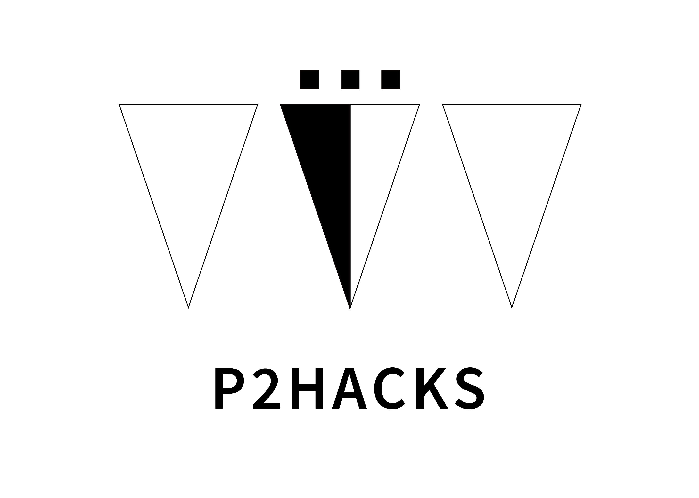

# プロダクト名

## 製品概要
### コンセプト
友達を記憶して、思い出すツール　人リマインド

### 背景（製品開発のきっかけ、課題等）

### 製品説明（具体的な製品の説明）

### 特長

#### 1つ目 

-他人の情報を貰うのではなく、自分で相手の情報を書き足していく

#### 2つ目

-書かれた側は、相手が自分のことをどう感じ取ったのかを確かめられる

### 解決出来ること
- 人の名前を忘れてしまうということ
- 新生活における友達が少ないと思ってしまう不安な気持ちの解消

### 今後の展望
- ネットワークのライブラリを使って、プロフィールの交換を可能にする。

## 開発内容・開発技術
### 活用した技術
#### 言語
- プロセッシング

#### フレームワーク・ライブラリ・モジュール（使っていれば）
 

#### デバイス（使っていれば）
- 学内推奨機 TOSHIBA Dynabook　

## メンバーの役割
- 芥川 祐大：友達追加機能、キーボード入力機能、機能の合体
- 荒木 亮介：ロゴ作成、スタート画面、Git管理、スライド作り
- 佐々木 輝義：並び替え機能の実装、タブのデザイン、似顔絵機能のデザイン、設定画面
- 芳賀 泰輔：友達一覧の機能、似顔絵機能、似顔絵機能の実装、キーボード入力機能、機能の合体

## 今回のハッカソンで得たこと（学び）
- 役割分担で生じる負担の偏りで、効率が悪くなること。
- githubが使えなくなることがあり、想定しておく必要があること。
- gitの使い方。
- 時間を常に意識しておく必要があること。
- あさりのすき焼きはおいしいということ。
- 情報共有することのメリットが分かった。
- 情報共有で、どれくらいのクオリティーのものを作るかを共有しておく必要があった。
- 情報共有で、自分が開発についていけるかを判断するべきだった。
- 内容を話し合って、分かってない部分を早めに理解することができた。